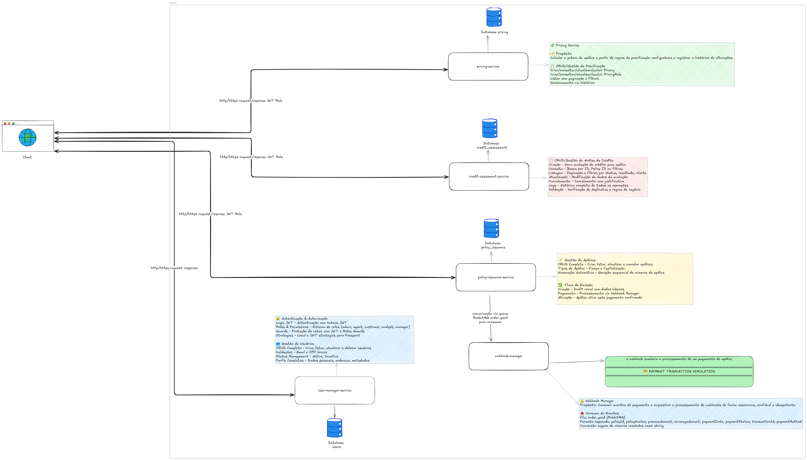

# 🏢 Sistema para Emissão de Apólices

Sistema completo de microserviços para gestão e emissão de apólices de seguro, desenvolvido com arquitetura moderna e tecnologias atuais.

## 🏗️ Arquitetura



## 🚀 Como Executar

### 1. Subir a Infraestrutura

```bash
docker-compose up -d
./test-database-structure.sh
```

### 2. Executar os Microserviços

Execute em terminais separados:

```bash
# Policy Issuance Service
cd policy-issuance-service && npm run start:dev

# Credit Assessment Service  
cd credit-assessment-service && npm run start:dev

# Pricing Service
cd pricing-service && npm run start:dev

# User Manager Service
cd user-manager-service && npm run start:dev

# Webhook Manager Service
cd webhook-manager-service && npm run start:dev
```

## 🛠️ Tecnologias Utilizadas

- **Backend:** NestJS, TypeScript, Node.js
- **Banco de Dados:** PostgreSQL, TypeORM
- **Message Broker:** RabbitMQ
- **Cache:** Redis
- **Testes:** Jest
- **Documentação:** Swagger/OpenAPI
- **Containerização:** Docker, Docker Compose

## 🧪 Testes Unitários

### User Manager Service
- `user.service.spec.ts` - Testes do serviço de usuários
- `user.controller.spec.ts` - Testes do controller de usuários
- `auth.service.spec.ts` - Testes do serviço de autenticação
- `auth.controller.spec.ts` - Testes do controller de autenticação
- `rabbitmq.service.spec.ts` - Testes do serviço RabbitMQ
- `redis.service.spec.ts` - Testes do serviço Redis

### Policy Issuance Service
- `policy.service.spec.ts` - Testes do serviço de apólices
- `policy.controller.spec.ts` - Testes do controller de apólices
- `external-integration.service.spec.ts` - Testes de integração externa
- `rabbitmq.service.spec.ts` - Testes do serviço RabbitMQ

### Credit Assessment Service
- `credit-assessment.service.spec.ts` - Testes do serviço de avaliação de crédito
- `credit-assessment.controller.spec.ts` - Testes do controller de avaliação de crédito
- `assessment-criteria.service.spec.ts` - Testes do serviço de critérios de avaliação
- `assessment-log.service.spec.ts` - Testes do serviço de logs de avaliação
- `credit-scoring.service.spec.ts` - Testes do serviço de scoring de crédito

### Pricing Service
- `pricing-calculation.service.spec.ts` - Testes do serviço de cálculo de preços
- `pricing-history.service.spec.ts` - Testes do serviço de histórico de preços
- `pricing.controller.spec.ts` - Testes do controller de preços

## 📚 Documentação das APIs

Cada microserviço possui documentação Swagger disponível em:

- **Policy Issuance Service:** `/api/docs`
- **Credit Assessment Service:** `/api/docs`
- **Pricing Service:** `/api/docs`
- **User Manager Service:** `/api/docs`
- **Webhook Manager Service:** `/api/docs`

## 🎯 Funcionalidades

- ✅ **Gestão de Usuários** - Autenticação e autorização
- ✅ **Emissão de Apólices** - Criação e gestão de apólices
- ✅ **Avaliação de Crédito** - Criação e gestão de avaliações de crédito
- ✅ **Precificação** - Criação e gestão de precificações
- ✅ **Webhooks** - Processamento de pagamentos
- ✅ **Auditoria** - Logs e eventos de sistema

## 🔧 Estrutura do Projeto

```
backend-emition/
├── policy-issuance-service/     # Serviço de emissão de apólices
├── credit-assessment-service/   # Serviço de avaliação de crédito
├── pricing-service/            # Serviço de precificação
├── user-manager-service/       # Serviço de gestão de usuários
├── webhook-manager-service/    # Serviço de webhooks
├── init-scripts/              # Scripts de inicialização do banco
├── docker-compose.yml         # Configuração dos containers
└── test-database-structure.sh # Script de teste da estrutura
```

## 🎉 Pronto para Usar!

Após executar os comandos acima, o sistema estará totalmente funcional com:

- 🗄️ **Banco de dados** configurado automaticamente
- 🔐 **Usuários padrão** criados (admin/admin123)
- 📊 **Dados de exemplo** inseridos
- 🌐 **APIs documentadas** e prontas para uso
- 🧪 **Testes unitários** implementados
